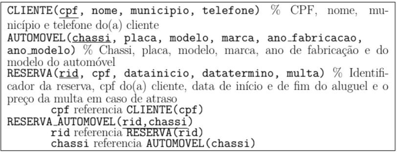

# Sistema de locadora de automóveis :car:

## Repositório para prática de SQL com consultas desenvolvidas no MySQL  

### Sumário :pushpin:

1. Descrição
2. Consultas realizadas   
2.1.Nível Básico   
2.2. Nível Intermediário  
2.3. Nível Avançado  

 
---------------------------
### 1. Descrição

Abaixo está a imagem representando o esquema relacional dessa empresa de aluguel de automóveis, a relação RESERVA apresenta as reservas de automóveis realizados por um(a) determinado(a) cliente. Em uma mesma reserva o(a) cliente pode reservar diversos automóveis, situação representada pela relação RESERVA_AUTOMOVEL. 

 

---------------------------
### 2. Consultas Realizadas 
#### 2.1. Nível Básico :green_circle: (arquivo das consultas [aqui](consultas_basicas.sql))
1.  Liste o nome e telefone de todos os clientes cadastrados.
    
2.  Mostre o modelo, marca e ano de fabricação de todos os automóveis.
    
3.  Exiba todas as reservas realizadas em 2025.
    
4.  Mostre o CPF dos clientes que possuem multa maior que 300 reais.
    
5.  Liste os automóveis da marca “Fiat” ou “Toyota”.

#### 2.2. Nível Intermediário :orange_circle: (arquivo das consultas [aqui](consultas_intermediarias.sql))
1.   Mostre o nome dos clientes que já realizaram pelo menos uma reserva.
    
2.  Liste os modelos de automóveis que foram reservados mais de uma vez.
    
3.  Exiba o total de reservas realizadas por cada cliente.
    
4. Mostre o nome do cliente e o valor médio das multas que ele pagou.
    
5. Liste os automóveis que **ainda não foram reservados**.
    
6. Mostre o nome e o número de reservas de cada cliente, ordenados do que mais reservou para o que menos.
    
7.  Exiba os clientes que realizaram **mais de 3 reservas**.
    
8. Mostre os automóveis que foram reservados por **mais de 5 clientes diferentes**.
    
9.  Liste os clientes que **nunca receberam multa**.
    
10.  Exiba o nome do cliente e a soma total de multas que ele já pagou.

#### 2.3. Nível Avançado :red_circle: (arquivo das consultas [aqui](consultas_avancadas.sql)) 

1.  Mostre os **automóveis mais reservados** no sistema (pode haver empate).
    
2.  Exiba o **cliente que mais fez reservas**.
    
3.  Liste o(s) **cliente(s)** que já **reservaram todos os automóveis** disponíveis.
4.  Exiba os **modelos mais populares** (os mais reservados entre todos os clientes).
